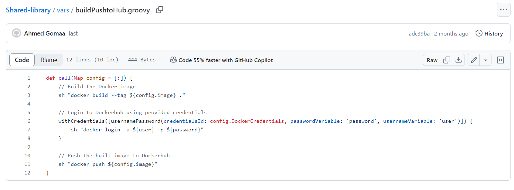

# K8s-Jenkins-Deployment

## Overview
The "K8s-Jenkins-Deployment" project facilitates the deployment of applications using Kubernetes (K8s) and Jenkins pipelines. This project streamlines the setup process, automating the deployment steps from building Docker images to deploying applications on Kubernetes clusters.

## Table of Contents
- Prerequisites
- Getting Started
- Pipeline Steps
- Jenkinsfile Example
- Jenkins Shared Libraries
- Pipeline Post Actions

## Prerequisites
Before using this project, ensure that you have the following prerequisites:

- Docker: For building and managing containerized applications.
- Kubernetes/OpenShift: For orchestrating containerized applications.
- Jenkins: For implementing continuous integration and continuous deployment (CI/CD) pipelines.
- Docker Hub Account: For storing Docker images.
- Git: For version control and cloning the project repository.

## Getting Started
To deploy applications using this project, follow these steps:

1. Clone the "K8s-Jenkins-Deployment" project repository to your local machine:

```bash
git clone https://github.com/gAhmedg/jenkins-project.git
```
2. Set up your K8s environment, preferably using OpenShift, and create a service account for the deployment process.

3. Configure Jenkins to integrate with your project repository and set up the required credentials (e.g., Docker Hub credentials).

4. Set up the Jenkins pipeline using the provided Jenkinsfile or customize it according to your requirements.

5. Configure the pipeline to trigger on changes to the repository and define the pipeline steps as outlined below.

## Jenkinsfile Example
Here's an example Jenkinsfile that defines the pipeline stages:


```groovy
@Library('shared-library') _

pipeline {

environment { 
        imageName = 'algn48/nti-app-python'
        yamlfiles = 'kuberenetes/DeploymentAndServices.yml'
                            
    }
     agent any
     stages {
            stage('Verify Branch') {
            steps {
                echo "$GIT_BRANCH"
            }        
          }
   
        stage('Build and Push Docker Image') {
            steps {       
               script {
                    buildPushtoHub([ image: "${imageName}:${BUILD_NUMBER}", DockerCredentials: 'DOCKERHUB' ])
                } 
            }
        }
   
    stage('Deploy in kubernetes') {
            steps {                                                       
            withKubeCredentials(kubectlCredentials: [[caCertificate: '', clusterName: '', contextName: '', credentialsId: '4', namespace: 'ahmedgomaa', serverUrl: 'https://api.ocp-training.ivolve-test.com:6443']]) {    
                sh "sed 's|image:.*|image: ${imageName}:${BUILD_NUMBER}|' ${yamlfiles} > python-app.yml"
                 
                 sh 'oc apply -f python-app.yml -n ahmedgomaa'                   
            }
        }
        } 
    }
}
```
## Jenkins Shared Libraries

### Jenkins Shared Library
Create the following Groovy scripts in your shared library:
my custem Shared Library you will find i there

```
https://github.com/gAhmedg/Shared-library
```

- buildAndPush.groovy:

